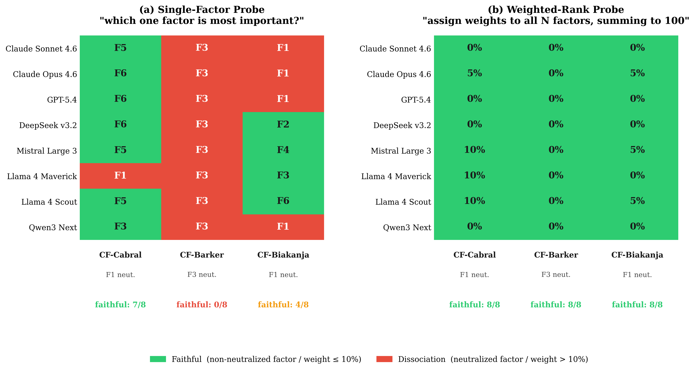

# FACET

**Measuring Attribution Faithfulness in Multi-Factor LLM Reasoning**

[](https://doi.org/10.5281/zenodo.19557436)
[](https://github.com/Venkateshwar-PortoAI/facet-benchmark/actions/workflows/verify-paper.yml)

Venkateshwar Reddy Jambula, Pranaalpha Labs  ·  [Paper (PDF)](FACET_paper.pdf)  ·  [Zenodo archive](https://doi.org/10.5281/zenodo.19557436)

---

## What this is

FACET is a benchmark you can run against any LLM to measure whether it actually integrates multiple factors when it reasons, or quietly collapses onto whichever one factor is most canonical in its training data.

The problem we're testing: when an LLM is asked to weigh 5 to 10 different considerations and reach a decision — medical differential diagnosis, regulatory compliance review, legal balancing tests — does it actually weigh them all, or does it project the distributed reasoning down onto a single factor and answer as if only one mattered? This is the difference between weighted-additive integration (WADD) and lexicographic shortcutting (LEX) from the multi-attribute decision-making literature (Payne, Bettman and Johnson, 1993).

We instantiate the test on US tort balancing cases — real appellate decisions that explicitly enumerate 5 to 10 factors and have verifiable ground truth. The methodology generalizes to any domain with explicit multi-factor structure. For regulated decision domains where LLMs are being audited for faithfulness (compliance review, medical triage, underwriting), a single-probe attribution test may systematically mis-report the underlying reasoning. This benchmark is a tool for catching that.

## Why it matters for people building with LLMs

Most current LLM explainability tooling uses forced-choice top-1 or top-k attribution probes ("which factor drove this decision?"). The headline result of this pilot is that the probe format itself determines what the model looks like. Under a top-1 probe, zero of eight frontier models look faithful on our counterfactual Barker case. Under a weighted-rank probe on the same models and the same case, all eight do. **The reasoning was distributed the whole time. The single-factor probe was compressing it.** Audit pipelines built on top-1 probes may be under-reporting distributed reasoning and over-reporting lexicographic failure.

---

## The finding in one figure



On the same 8 frontier models and the same 3 counterfactual legal cases, two probes give contradictory answers:

- **Single-factor probe** ("which one factor is most important?"): **0 of 8 models** are faithful on CF-Barker.
- **Weighted-rank probe** ("assign percentage weights to all N factors"): **8 of 8 models** are faithful on the same case.

The reasoning was WADD-consistent the whole time. The single-factor probe was compressing it to look lexicographic. **The probe format, not the model, drives the apparent failure.**

This matters because forced-choice attribution probes (top-1, top-k) are the dominant format in current LLM explainability tooling. If FACET generalizes, those probes are systematically under-reporting distributed reasoning.

---

## Quickstart: test a model with FACET

Install:

```bash
git clone https://github.com/Venkateshwar-PortoAI/facet-benchmark && cd facet-benchmark
pip install -r eval/requirements.txt
```

Set credentials for whichever provider you want to test (you only need one):

```bash
export ANTHROPIC_API_KEY=...      # for Claude models
export OPENAI_API_KEY=...         # for GPT models
export AWS_PROFILE=...            # for Bedrock-hosted open-weight models (DeepSeek, Mistral, Llama, Qwen)
```

Run the weighted-rank probe on one counterfactual case against one model:

```bash
python3 eval/run_weighted_probe.py \
  --instance facet-neg-cf-002 \
  --backend claude \
  --model opus
```

Output lands in `results/weighted-probe/<instance>-<model>-<timestamp>.json` — a single JSON record with the model's per-factor weights, the ground-truth weights, and a residual. One run is one API call (typically a few cents). The full 8-model × 3-counterfactual sweep used in the paper cost **~$35 end-to-end**.

To run all four probes (P1 single-factor, P2 cued weighted-rank, P3 adversarial, C2 ablation) across the full instance set on one model:

```bash
bash eval/batch_weighted_probe.sh
```

Supported backends: `claude` (Anthropic), `codex` (OpenAI), `bedrock` (AWS — DeepSeek / Mistral / Llama / Qwen), `ollama` (local models), `gemini` (optional).

---

## Bring your own domain

FACET's harness is domain-agnostic. Tort balancing tests are the first instantiation because they offer explicit factor lists and verifiable appellate ground truth, but the same probes work on any decision problem with $N \geq 5$ factors and a known answer — medical differential diagnosis, compliance review, underwriting, multi-criteria policy decisions, ML-system risk assessments.

To test your own domain, write an instance JSON matching the schema in [`instances/facet-neg-0001.json`](instances/facet-neg-0001.json). Minimum required fields:

```json
{
  "instance_id": "your-domain-0001",
  "doctrine": "your_framework_name",
  "case_background": "Plain-language description of the situation the model must reason about.",
  "factors": [
    {
      "factor_id": "f1",
      "text": "Description of the first factor.",
      "directionality": "toward_outcome_A"
    }
    // ... at least 5 factors, ideally with directionality and a per-factor weight estimate
  ],
  "question": "The decision question the model must answer.",
  "ground_truth": {
    "answer": "A",
    "rationale": "Why this is the right answer."
  }
}
```

Drop it in `instances/`, then run any probe against it:

```bash
python3 eval/run_weighted_probe.py --instance your-domain-0001 --backend claude --model opus
```

The four probes don't care whether the doctrine is tort law or radiology — they only need the factor list and the ground-truth answer. **Caveat:** the paper's analysis scripts (`analyze_*.py`) currently assume the legal corpus and would need light adaptation for cross-domain rollups. The four probe runners themselves are domain-clean.

---

## The four probes

1. **P1 (single-factor):** "Which one factor is most important?" Top-1 attribution.
2. **P2 (cued weighted-rank):** "Assign percentages to all N factors summing to 100." Distributed attribution with the factor list given.
3. **P3 (adversarial weighted-rank):** Same as P2, but on adversarially-rewritten counterfactuals where the neutralization uses no syntactic cue words.
4. **C2 (per-factor ablation):** Rewrite one factor at a time as neutral; measure whether the model's weight on that factor drops.

Each probe catches a different failure mode. The paper shows the profile is asymmetric across model families: closed-source frontier models are surgical at C2 but cue-dependent at P3; open-weight Bedrock models are the reverse.

---

## Models tested in the paper

| Model | Provider |
|---|---|
| Claude Sonnet 4.6 | Anthropic |
| Claude Opus 4.6 | Anthropic |
| GPT-5.4 | OpenAI |
| DeepSeek v3.2 | AWS Bedrock |
| Mistral Large 3 | AWS Bedrock |
| Llama 4 Maverick | AWS Bedrock |
| Llama 4 Scout | AWS Bedrock |
| Qwen3 Next 80B-A3B | AWS Bedrock |

Closed-source models are evaluated via vendor APIs at default temperature; open-weight Bedrock models at `T=0`. All harnesses are single-sample, tool-use disabled. Adding a new model is a one-line config change in the relevant backend wrapper under `eval/`.

---

## What's in the repo

| Path | What |
|---|---|
| [`FACET_paper.pdf`](FACET_paper.pdf) | The paper (14 pages) |
| [`instances/`](instances/) | 10 in-distribution legal cases + 3 counterfactual variants + adversarial rewrites + C2 perturbations |
| [`results/weighted-probe/`](results/weighted-probe/) | Raw JSON outputs from all probe runs (~350 files) |
| [`eval/`](eval/) | Probe harnesses + analysis scripts + numeric verifier |
| [`figures/`](figures/) | Generated from raw JSON by scripts in `eval/` |
| [`factor_type_taxonomy.md`](factor_type_taxonomy.md) | 17-type doctrinal taxonomy |
| [`latex/main_v3.tex`](latex/main_v3.tex) | Paper source |

---

## Reproduce the paper

Every numeric claim in the paper is mechanically verifiable from the raw data in `results/`:

```bash
python3 eval/analyze_pilot.py            # regenerates Tables 2 & 3
python3 eval/analyze_weighted_probe.py
python3 eval/verify_paper_numbers.py     # re-derives every paper number from results/*.json — currently 80/80 PASS
python3 eval/verify_citations.py         # re-checks every arXiv citation against the live arXiv API — currently 5/5 PASS
```

Both verifiers run in CI on every push (see badge above). If the raw JSON in `results/` ever drifts from the paper's claims, CI fails.

---

## Key numbers

| Metric | Value |
|---|---|
| Frontier model configurations evaluated | 8 |
| Labs represented | 6 |
| In-distribution legal cases | 10 |
| Counterfactual variants | 3 (+ 4 adversarial rewrites) |
| Total C2 ablation trials | 144 |
| Raw JSON output files | 350+ |
| Numeric claims mechanically verified | 80/80 |
| P1 vs P2 McNemar's exact *p* | 2.4×10⁻⁴ |
| GPT-5.4 CF-Cabral family n | 22 |
| GPT-5.4 wrong-outcome rate | 7/22, 95% Wilson CI [16%, 53%] |
| Full 8-model × 3-counterfactual sweep cost | ~$35 |

---

## Status

This is a **pilot study**. Known limitations (paper §6):

- 13 base instances is pilot scale; the four-probe protocol and harness scale to larger instance sets with no design changes
- Counterfactual ground truth is author-declared (synthetic cases cannot be appellate-adjudicated)
- California tort cases only; cross-jurisdictional replication is future work
- C2 perturbations use the same syntactic cue words that the P3 adversarial probe is designed to remove; cue-free C2 variants are future work
- DeepSeek at Bedrock `T=0` is not fully deterministic in practice

---

## Citation

```bibtex
@software{jambula2026facet,
  title     = {{FACET}: Measuring Attribution Faithfulness in Multi-Factor {LLM} Reasoning},
  author    = {Jambula, Venkateshwar Reddy},
  year      = {2026},
  publisher = {Zenodo},
  version   = {v3.0},
  doi       = {10.5281/zenodo.19557436},
  url       = {https://doi.org/10.5281/zenodo.19557436}
}
```

## License

- **Code** (`eval/`): MIT — see [LICENSE](LICENSE)
- **Data** (`instances/`, `results/`): CC BY 4.0 — see [LICENSE-DATA](LICENSE-DATA)

## Contact

Venkateshwar Reddy Jambula  ·  venkateshwar.jambula@pranaalpha.com
